# HandMe

**HandMe** is a Django-based second-hand marketplace web application inspired by platforms like Avito, designed to facilitate the buying and selling of used items. Built with Django and PostgreSQL, the app allows users to create, manage, and edit listings, explore products by category, and view details, along with full user account functionality. 
The platform provides users a way to browse, add, and manage second-hand products. Key functionalities include filtering by category, location, and search keywords, alongside profile management features.

---
## Features

### 1. **Product Listing and Details**
   - All products are displayed in a grid layout on the homepage.
   - Users can click on a product to view its details, including title, description, image, price, and seller contact.

### 2. **User Authentication**
   - Register, sign-up, login, and logout functionalities.
   - Profile page that displays user information with options to update profile picture and personal details.
   - Account deletion option available in the profile settings with a confirmation popup.

### 3. **Product Filtering and Search**
   - **Category and Location Filtering**: Filter products based on predefined categories and locations.
   - **Search Box**: Search for products using keywords in the title, description, or price range.
   - **Simultaneous Filtering**: Combines search and filter criteria for more precise results.

### 4. **Product Management**
   - Users can add, edit, or delete their products.
   - Products include details such as title, category, description, price, location, and an optional image.
   - A custom popup confirmation is provided for product deletion.
   - Ability to add new categories from the product editing page.

### 5. **Visual Design**
   - Modern and responsive design, suitable for both desktop and mobile views.
   - CSS styling includes custom colors, shadow effects, animations, and smooth transitions.
   - A user-friendly interface with clear calls-to-action.

---

### Tech Stack
* **Backend**: Django, PostgreSQL
* **Frontend**: HTML, CSS, JavaScript, Bootstrap
* **Styling**: Custom-styled popups, interactive navigation, and form controls
### Setup
#### Clone the repository:

```bash
git clone https://github.com/savinleonid/HandMe.git
```

#### Create virtual environment: 

```bash
python -m venv .venv
```

#### Activate virtual environment: 

```bash
.venv\Scripts\activate
```

#### Install dependencies: 

```bash
pip install -r requirements.txt
```
### Setup Database:

#### Configure PostgreSQL in your Django settings.py. Add .env file for secure handling secret keys.
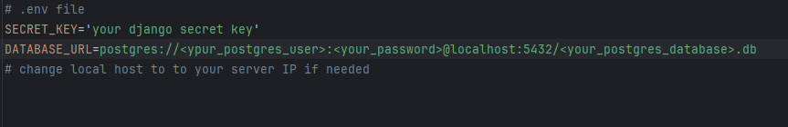

#### Run migrations:
```bash
python manage.py migrate
```
### Run server:

```bash
python manage.py runserver
```
## Usage
- Access the homepage to browse available items.<br>

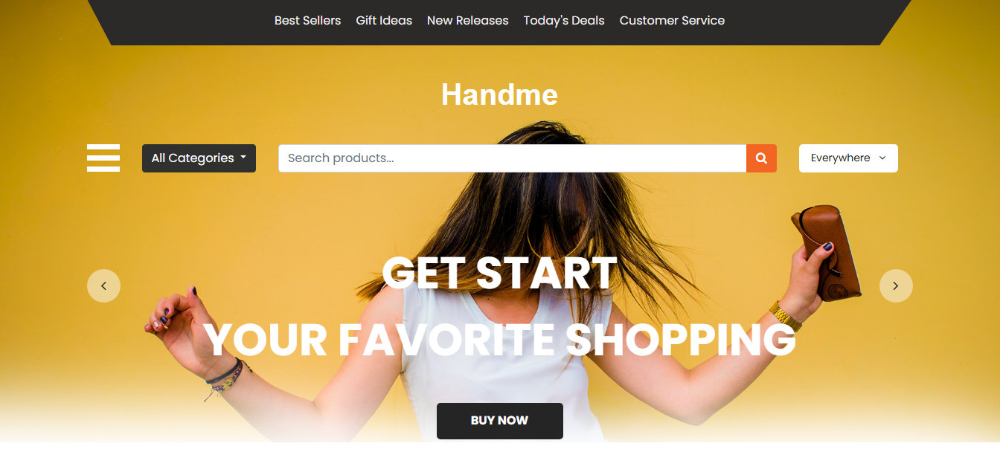

- Register or log in to add or manage your own listings.<br>

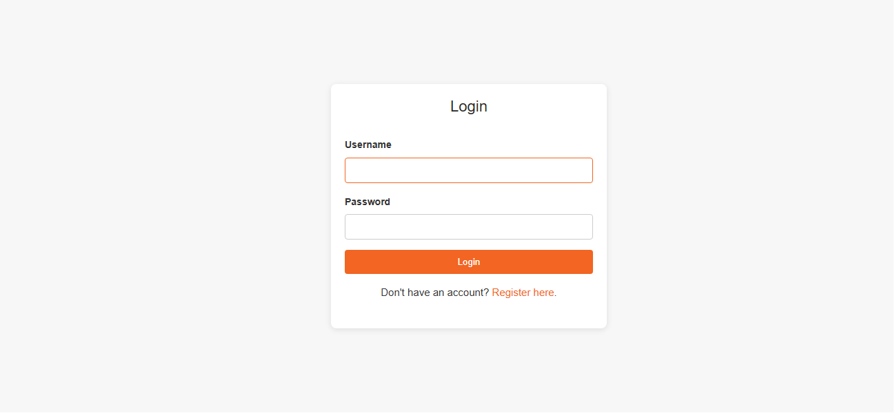
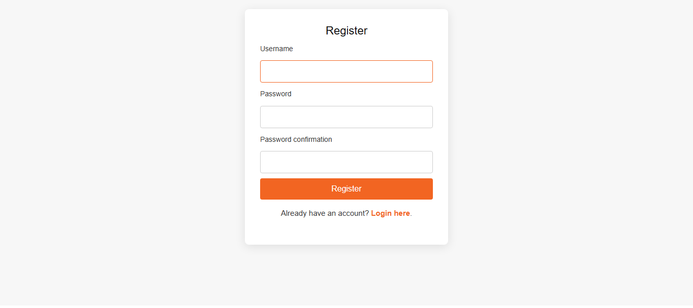
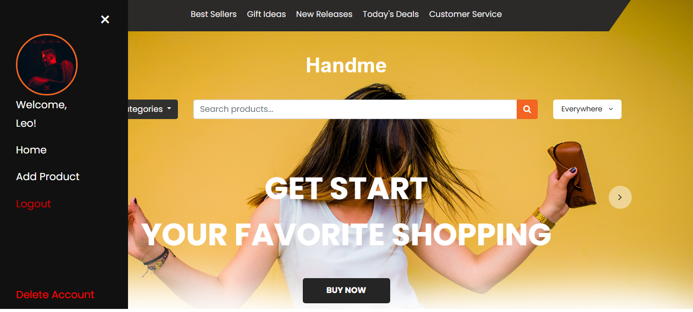

- Use search, category filters, and location options for targeted browsing.
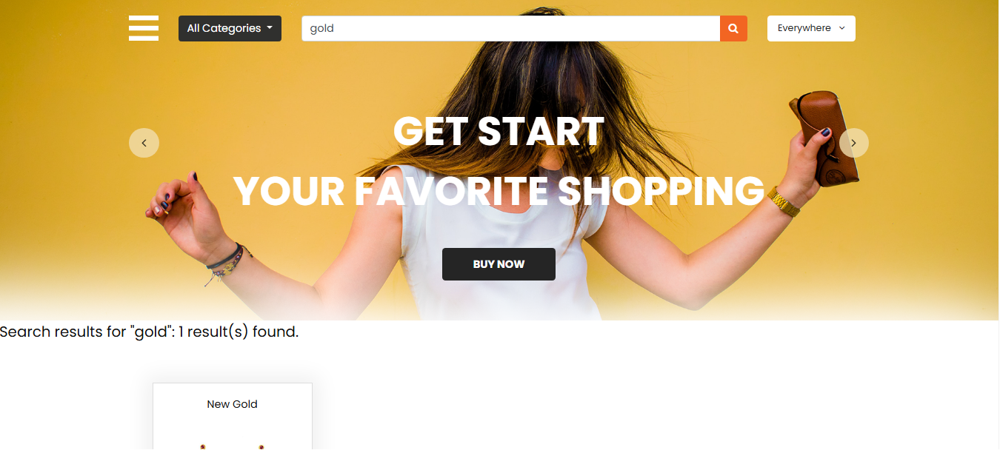

- Add, update or delete products.

<p float="left">
    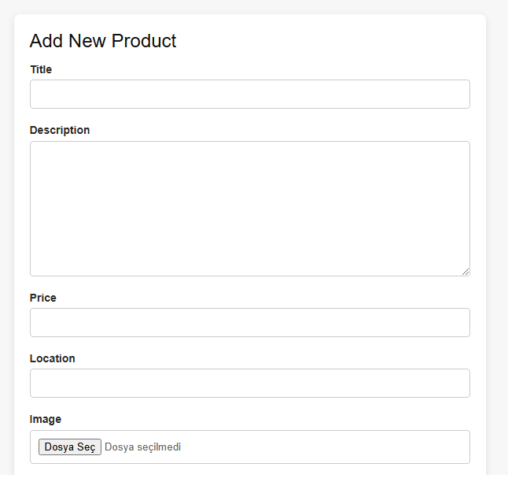 
    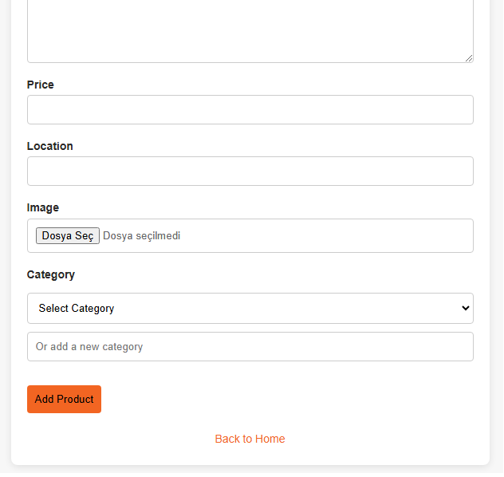
</p>
<p float="left">
    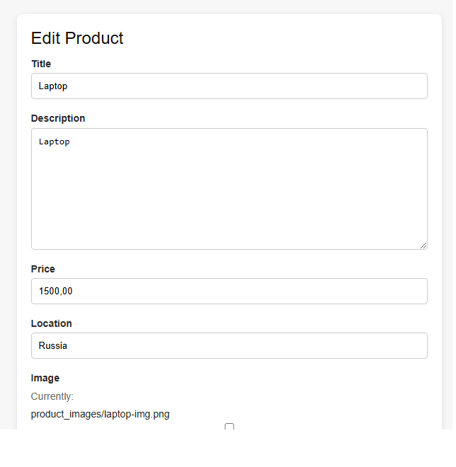 
    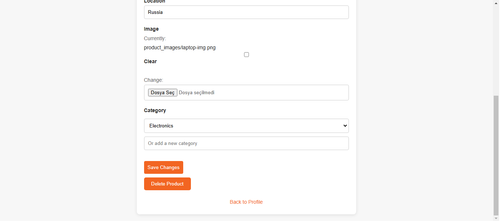
</p>
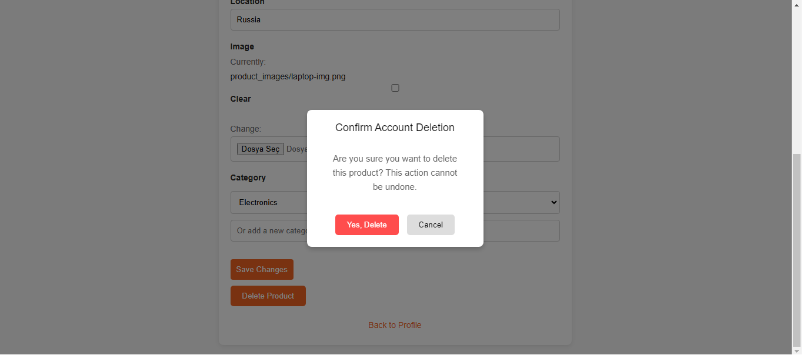 

- User related profile view.

<p float="left">
    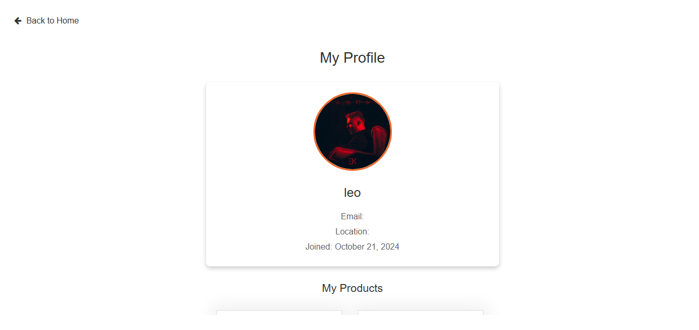 
    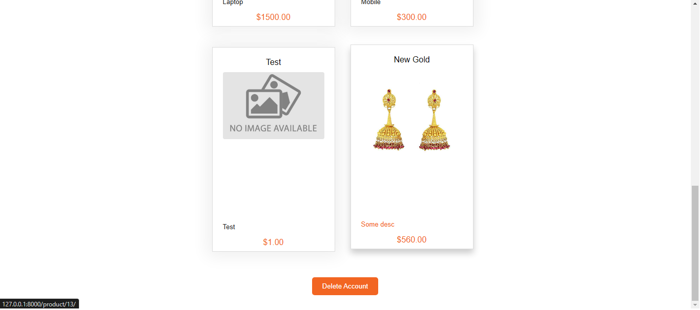
</p>
<p float="left">
     
    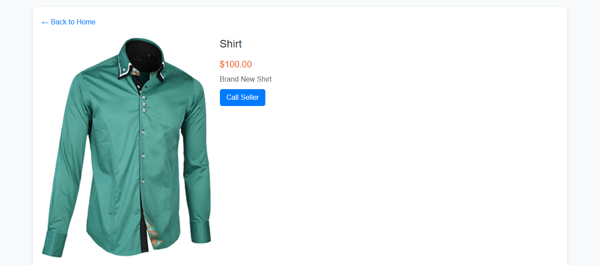
</p>

## Contributing
- Fork the project.
- Create a new branch (git checkout -b feature/YourFeature).
- Commit your changes (git commit -m 'Add new feature').
- Push to the branch (git push origin feature/YourFeature).
- Open a pull request.
## License
Distributed under the MIT License.

